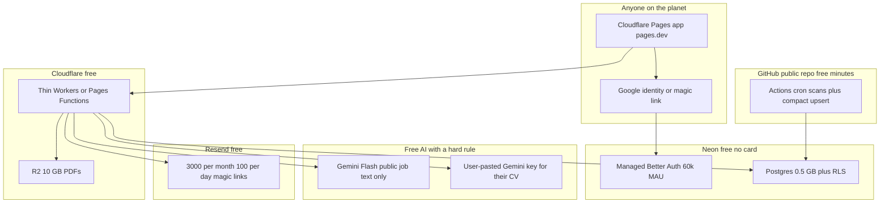
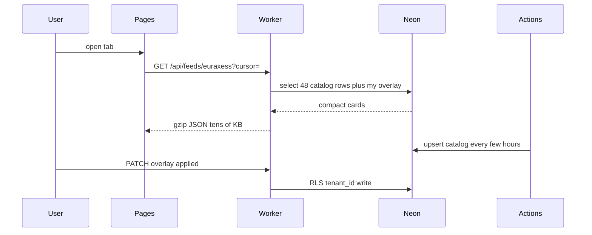

# Public Career OS plan (phases 0–4)

**Where this lives:** [`apps/web/PLAN.md`](PLAN.md) on branch `cursor/zero-cost-public-saas-0a19` ([PR #3](https://github.com/harshddes/career-ops/pull/3)). Cursor also kept a copy under `/opt/cursor/artifacts/plans/` on the cloud VM, which is why it did not show up in the GitHub repo.

**What shipped vs what is still the plan**

| Phase | In the plan? | In the code today? | Live on the public internet? |
|------|----------------|-------------------|------------------------------|
| 0 Login + isolated workspaces | yes | **yes** (custom sessions, not Neon Better Auth) | **yes** — https://career-os-web.harshddes.workers.dev |
| 1 Shared catalog + Applied kanban + research inbox | yes | **yes** | **yes** after sign-in (Worker uses HTTP Neon; catalog ingest runs on deploy) |
| 2 CV text, rule scores, print resume, file-to-textarea (Gemini left out on purpose) | yes | **yes** | **yes** after sign-in (`/profile`, `/resume`) |
| 3 Networking people, Resend digest cap, export/delete | yes | **yes** | **yes** after sign-in; digest/magic-link mail still needs Resend key |
| 4 Privacy/terms + Docker factory for :3737 | yes | **yes** | privacy/terms are public; Docker is local-only |
| Cloudflare Pages `*.pages.dev` | plan default | **Workers `*.workers.dev`** instead (same $0 HTML host) | after deploy |
| Neon Managed Better Auth | plan default | **not wired** — custom password / magic-link / Google in `auth.mjs` | n/a |
| R2 PDF bucket | plan “only if files” | **not built** — CV is text in Postgres | n/a |
| Student `.me` domain / Google brand verify | phase 4 extras | **you**, after a hostname exists | n/a |

Click-by-click for the accounts you create: [`SETUP.md`](SETUP.md).

---

# $0 public Career OS (rewrite, not upload)

## What changed after the deeper pass

You do not have money. The last draft defaulted to Railway at tens of dollars. That was the wrong default. People do ship real login apps at $0. They do it by **staying inside permanent free tiers** and by **not running an always-on VM**.

This environment could not run `/parallel-research`, `/parallel-search`, `/firecrawl-agent`, or `/firecrawl-crawl`: `parallel-cli` and `firecrawl` are not installed. Exa MCP is rate-limited without your own key. Bright Data search returned 401. Research below used official docs plus current 2026 pricing pages. To unlock those CLIs on the next pass, run `/parallel-setup` and install Firecrawl (`npm i -g firecrawl-cli` then `firecrawl login --browser`), and add your own Exa key if you want unlimited Exa.

The product conclusion did not change: **the current repo is a one-person disk OS**. There is no auth. Every write hits shared JSON. Scans can be Node. Full evals and resume packs wait for a Cursor agent ([WEB-TRACKER/lib/agent-task-queue.mjs](WEB-TRACKER/lib/agent-task-queue.mjs)). You still cannot zip `data/` onto a URL. You **can** build a public website that anyone logs into, for $0, if the architecture matches free-tier physics.

Keep `http://127.0.0.1:3737/dashboard/fusion-pivot-dashboard.html` as your personal OS. Do not upload Networking, Gmail threads, or `cv.md` into the public database.

## The $0 architecture (locked default)

Two planes, same as before:

- **Shared catalog:** public job rows (EURAXESS, PhDScanner, U-M, Live Jobs). One GitHub Action writes compact list fields. Every user reads the same catalog. Nobody downloads 6–8 MB.
- **Private workspace:** profile, saved/applied, notes, networking, artifacts. `tenant_id` + Postgres RLS.

Why this stack, not Railway:

- [Neon Free](https://neon.com/docs/introduction/plans) is permanent, no credit card: 0.5 GB storage, 100 CU-hours/project/month, 5 GB egress, scale-to-zero after 5 minutes, **Managed Better Auth up to 60k MAU**.
- [Cloudflare Workers/Pages Free](https://developers.cloudflare.com/workers/platform/pricing/): 100k requests/day, D1 5 GB / 5M reads/day, [R2](https://developers.cloudflare.com/workers/platform/pricing/) 10 GB + free egress. Hostname: `*.pages.dev`. No card.
- [GitHub Actions](https://docs.github.com/en/billing/concepts/product-billing/github-actions) on a **public** repo: standard hosted runners are free. That is the $0 cron/worker. Private repos only get 2,000 minutes/month.
- [Gemini Flash free tier](https://tokenmix.ai/blog/gemini-api-free-tier-limits) via AI Studio: no card, roughly 1,000–1,500 Flash requests/day depending on model. Free-tier prompts can be used to train Google. So the shared key may touch **public job text only**. User CVs use **that user’s own key**.
- [Resend Free](https://nuntly.com/resend-pricing): 3,000 emails/month, 100/day, no card. Magic links and “pack ready.” Not mass digests.
- Google Sign-In with `openid email profile` only is free. Testing apps that request **only** those scopes can be used by any Google user ([Google OAuth app state](https://developers.google.com/identity/protocols/oauth2/production-readiness/overview)). Gmail inbox access is a different, verified product.

API handlers must stay **thin**. Cloudflare Free is [10 ms CPU per invocation](https://developers.cloudflare.com/workers/platform/limits/). That is enough for “SQL + return 48 cards.” It is not enough to `JSON.parse` an 8 MB store or run Playwright. GitHub Actions does the heavy scan/project work **before** the request.

Neon sleeps after 5 minutes idle ([scale-to-zero](https://neon.com/docs/guides/scale-to-zero-guide)). First click after idle is a short wake. That is the $0 tax. A public GitHub Action that upserts the catalog a few times a day also keeps the project from looking dead.

## What $0 can fully do (no fake loopholes)

These are real, complete features on free tiers:

- Login with Google or email magic link
- Isolated workspaces (User A cannot see User B)
- Browse shared EURAXESS / U-M / PhDScanner / Live Jobs from compact rows
- Save, mark Applied, kanban, notes
- Today-style activity for **that user**
- Upload/paste a CV stored privately
- Rule-based fit scores (existing scoring logic, no LLM)
- Optional Gemini summary of a **public** posting
- Optional CV/cover draft if the user pastes their own Gemini key
- HTML resume they can print to PDF in the browser (no xelatex on the edge)
- Per-user networking CRM (no LinkedIn scrape)
- Export and delete my data
- Public URL on `pages.dev` while you have no domain

## What $0 cannot honestly promise

Say this in the product, do not hide it:

- **Not Cursor-on-your-PC.** Factory packs today wait for an agent and `xelatex`. Free Gemini Flash is a different quality bar. Offer Docker self-host for people who want the current agent factory on their laptop.
- **Not Gmail send-as-me.** Restricted/sensitive Gmail scopes need Google verification. Use Resend from the app, or let the user copy the draft.
- **Not per-user Playwright crawls.** One shared Action scans public feeds. FindAPhD/bot-gated sources run less often or stay on your local :3737.
- **Not always-on Ollama / autonomy-runner.** Railway/Oracle VM territory.
- **Not silent 50k-user scale.** Neon 0.5 GB + 5 GB egress + Workers 100k req/day will fail if this becomes huge. That is a success problem. Compact list rows (already built) are what make the free tier viable at all.
- **Not a custom hostname** until you get a free student `.me`/`.tech` later or pay ~$10/year. Google brand verification wants a domain you own. Identity-only login still works on `pages.dev` with a warning screen.

## Rejected “free” options (and why)

- **Upload Express to a VPS:** no tenant isolation; [write-API audit](WEB-TRACKER/server.mjs) has zero auth; SMTP is your Gmail app password.
- **GitHub Pages snapshot:** look-only ([WEB-TRACKER/docs/hosting.md](WEB-TRACKER/docs/hosting.md)).
- **Tunnel to :3737:** your folder, your PII, PC must stay on.
- **Railway / Render / Fly as default:** real apps, not $0.
- **Vercel-only API:** serverless timeouts; scans and Playwright do not fit.
- **Cloudflare Workers cron for scans:** Free cron is [10 ms CPU](https://developers.cloudflare.com/workers/platform/limits/). Use GitHub Actions instead.
- **Supabase Free as primary DB:** works (Auth + RLS + 50k MAU, no card) but [pauses after 7 days of low activity](https://supabase.com/docs/guides/platform/free-project-pausing). Neon wakes on the next query instead of needing a dashboard click. Keep Supabase as backup.
- **Oracle Always Free ARM (2 OCPU / 12 GB as of Aug 2026):** the only $0 *always-on VM*. Capacity is often gone; identity checks often want a card; you become the sysadmin. **Plan B** if Actions + Neon is not enough.
- **Azure for Students $100 / 12 months:** lab money, then the app dies ([Azure for Students](https://azure.microsoft.com/en-us/free/students)).
- **GitHub Student Pack:** DigitalOcean credits ended 31 Jul 2026. Heroku is $13/month credit for 24 months if you qualify — temporary, not the foundation. Optional extra, not the architecture.
- **Shared Gemini key on user CVs:** Google may train on free-tier data. That is a privacy hole. Forbidden.

## System design (how requests actually work)

Reuse [WEB-TRACKER/lib/feed-list-projection.mjs](WEB-TRACKER/lib/feed-list-projection.mjs) as the **shape of catalog rows**, not as an Express query param on a fat file. Actions run the existing scan scripts (EURAXESS RSS is plain Node) and upsert list fields only.

Isolation tests are mandatory: two fixture users, cross-read returns zero rows, cross-write rejected. RLS `FORCE` on every tenant table.

## Accounts you create (all free, no card)

1. Cloudflare account
2. Neon account
3. Google Cloud OAuth client — scopes `openid email profile` only
4. Resend account — start on their test sender; add a domain only if you get one later
5. Optional: Google AI Studio key for **public job** summaries
6. Keep the SaaS app repo **public** so Actions minutes stay free (catalog is public postings; secrets stay in Actions secrets)

I cannot click Google’s OAuth terms or create those accounts for you. No extra Cursor plugin replaces that. Railway/Vercel/Azure MCP are not required for this path.

## Legal still applies at $0

Privacy page, terms, export, delete. CVs and networking notes are personal data ([ATS GDPR 2026](https://treegarden.io/blog/ats-gdpr-compliance-2026/)). MIT notice for career-ops ([LICENSE](LICENSE)). No LinkedIn scrape. Never auto-submit applications.

## Build sequence

### Phase 0 — Login website that is actually isolated

`apps/web` on Cloudflare Pages. Neon Auth / Better Auth. Google + magic link. Empty shell, logout, delete-account. RLS tests.

Done: a stranger can sign in and cannot see your rows.

### Phase 1 — Shared feeds + private tracker (the real MVP)

Public Action upserts compact `catalog_jobs`. Overlay: saved / applied / notes. One feed first (EURAXESS). 48-card pages. Mark Applied works.

Done: anyone can use a private kanban on shared jobs. This is a product. $0.

### Phase 2 — Profile and optional drafts

CV text in Neon. Rule scores always. Gemini on public JD text with the shared key, or full pack with the user’s key. Print-to-PDF in the browser. R2 only if files are small and private.

### Phase 3 — Networking + light mail

Per-user people/orgs. Resend under 100/day. Export/delete. No Gmail API.

### Phase 4 — Optional extras

Student `.me` domain if the Pack still gives one. Google brand verify. Docker Compose of the **existing** single-user app for people who want Cursor factory locally. Oracle VM only if Actions cannot hold the catalog.

## Defaults locked

- $0 stack: Neon + Better Auth + Cloudflare Pages + public GitHub Actions + Resend + Google identity
- Shared catalog, private overlay, RLS
- No Railway bill, no domain purchase, no Gmail API
- No shared Gemini on private CVs
- Local :3737 stays your machine

Approve this and the first PR is Phase 0 plus a stub EURAXESS catalog table — proof of login isolation, not a 12k-line HTML port.
